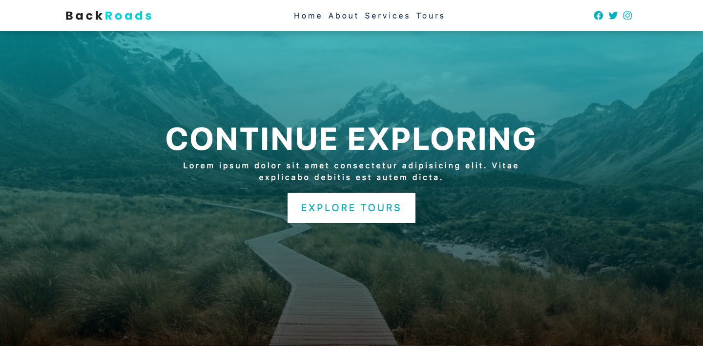

# BackRoads: Continue Exploring



## Project Description

A travel app powered by React.js for tours and services for users that enjoy broadening their horizons.

In this project, I created a landing page for travel company using `react.js`. CSS was also used to style to this project.

## Important Links

- https://backroads-ce.netlify.app/

### Setup Steps

1. [Fork and Clone](https://github.com/iamatos3/backroads-app) this repository.
2. ```npm install```
3. ```npm start```

### Technologies Used
- React.js
- HTML
- CSS